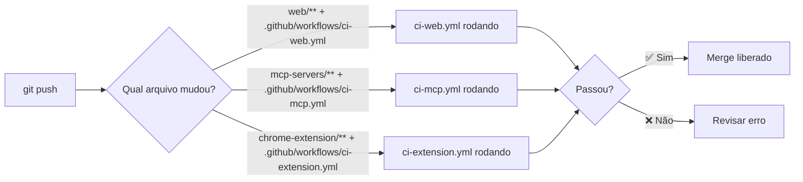

# CI/CD - Arquitetura de Workflows

Este repositório utiliza **GitHub Actions** para automação de CI/CD com suporte a um monorepo com 3 partes principais.

---

## 📁 Estrutura

```
.github/workflows/
├── ci-web.yml          # Next.js App (web/)
├── ci-mcp.yml          # MCP Servers (mcp-servers/)
└── ci-extension.yml    # Chrome Extension (chrome-extension/)
```

---

## 🎯 Workflows Detalhados

### 1. **ci-web.yml** — App Next.js

**Localização**: `.github/workflows/ci-web.yml`

```yaml
📌 Acionador:
   - push para main, develop
   - pull_request para main, develop
   - Apenas quando há mudanças em web/**

⚙️ Passos:
   1. Checkout do repositório
   2. Setup Node.js 20
   3. npm ci (com cache)
   4. npm run lint (Next.js lint)
   5. npm run build (Build com secrets de environment)

🔐 Secrets necessários:
   - NEXT_PUBLIC_SUPABASE_URL
   - NEXT_PUBLIC_SUPABASE_ANON_KEY
   - SUPABASE_SERVICE_ROLE_KEY
   - GEMINI_API_KEY
   - OPENAI_API_KEY
   - ANTHROPIC_API_KEY

📊 Variáveis (opcionais):
   - NEXT_PUBLIC_DEFAULT_MODEL (padrão: gemini-2.0-flash)
```

### 2. **ci-mcp.yml** — MCP Servers

**Localização**: `.github/workflows/ci-mcp.yml`

```yaml
📌 Acionador:
   - push para main, develop
   - pull_request para main, develop
   - Apenas quando há mudanças em mcp-servers/**

⚙️ Passos:
   1. Checkout do repositório
   2. Setup Node.js 20
   3. npm ci (com cache)
   4. npm run build (TypeScript compilation)

🔐 Secrets: Nenhum necessário para este workflow
```

### 3. **ci-extension.yml** — Chrome Extension

**Localização**: `.github/workflows/ci-extension.yml`

```yaml
📌 Acionador:
   - push para main, develop
   - pull_request para main, develop
   - Apenas quando há mudanças em chrome-extension/**

⚙️ Passos:
   1. Checkout do repositório
   2. Validação do manifest.json (JSON válido?)
   3. Verificação de arquivos obrigatórios
   4. Linter básico (opcional)

🔐 Secrets: Nenhum necessário para este workflow
```

---

## 🚀 Como usar

### Primeiro acesso (1️⃣ Configuração inicial)

1. **Clone o repositório** e veja que `.github/workflows/` já existe
2. **Vá para Settings → Secrets and variables → Actions**
3. **Adicione os secrets** conforme [GITHUB_SECRETS_SETUP.md](.github/GITHUB_SECRETS_SETUP.md)

### Fluxo de desenvolvimento (2️⃣ Depois que está tudo configurado)



---

## 📊 Exemplo: Push para Web App

```bash
# Você faz uma mudança em web/app/page.tsx
$ git add web/
$ git push origin main

# GitHub Actions automaticamente:
# 1. ✅ Faz checkout do código
# 2. ✅ Instala Node.js 20
# 3. ✅ Executa npm ci em web/
# 4. ✅ Roda npm run lint
# 5. ✅ Roda npm run build (com secrets injetados)
# 6. ✅ Reporta sucesso/falha
```

---

## 🔐 Segurança

### ✅ O que os workflows fazem com secrets:
- Injetam secrets como **variáveis de ambiente** durante o build
- **Nunca mostram** secrets nos logs (são mascarados automaticamente)
- Deletam todos os secrets após o workflow finalizar

### ⚠️ Boas práticas:
- **Não commitar** `.env` ou `.env.local` — use secrets do GitHub
- **Rodar testes localmente** com `.env.local` antes de push
- **Rotacionar secrets** periodicamente nas suas provedoras (Supabase, OpenAI, etc.)

---

## 📈 Monitoramento

### Ver status dos workflows:
1. Vá para **GitHub → Actions**
2. Selecione o workflow desejado
3. Veja histórico de execuções com badges (✅ / ❌)

### Adicionar badge ao README:
```markdown
[](https://github.com/seu-user/seu-repo/actions)
[](https://github.com/seu-user/seu-repo/actions)
```

---

## 🛠️ Customizações futuras

### Adicionar novo step:
```yaml
- name: Seu novo step
  run: echo "Rodar seu comando aqui"
  working-directory: web
```

### Adicionar novo secret:
1. Vá para **Settings → Secrets and variables → Actions**
2. **New repository secret**
3. Use como `${{ secrets.SEU_SECRET }}` no YAML

### Adicionar job paralelo:
Copie a seção `jobs:` e mude o nome, isso vai rodar em paralelo

---

## 📚 Referências

- [GitHub Actions Documentation](https://docs.github.com/en/actions)
- [Workflow syntax for GitHub Actions](https://docs.github.com/en/actions/using-workflows/workflow-syntax-for-github-actions)
- [Caching Node dependencies](https://github.com/actions/setup-node#caching-packages-dependencies)

---

## ❓ FAQ

**P: Por que não comitar .env?**  
R: Porque ele contém chaves secretas. Use `.env.example` como template e GitHub Secrets para os valores reais.

**P: Posso testar localmente antes de push?**  
R: Sim! Use `npm run lint` e `npm run build` em cada pasta para validar.

**P: E se um workflow falhar?**  
R: Vá para **Actions → Workflow que falhou → See details** e revise o erro.

**P: Como fazer um workflow custom?**  
R: Crie um novo arquivo em `.github/workflows/seu-workflow.yml` e adicione `on:` triggers.

