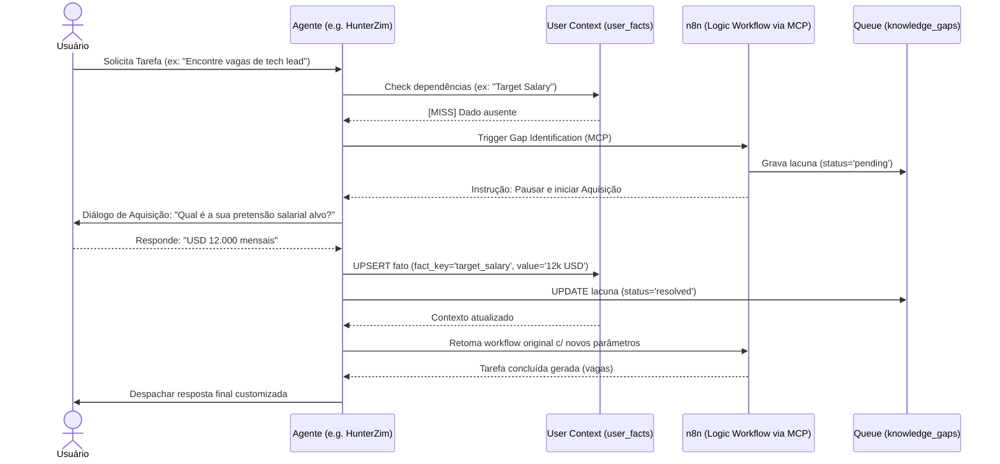

# Projeto: RonnyZim OS - Sistema de Inteligência Pessoal
> Planejamento do sistema operacional modular baseado em web para agentes internos e aprendizado ativo.

## 1. Visão Geral (Overview)
O RonnyZim OS é um sistema de inteligência pessoal moldado como um Web-Based Desktop OS. Ele orquestra 15 agentes internos (Personas) com um mecanismo crítico de **Aprendizado Ativo (Active Learning Engine)**, onde o sistema identifica proativamente lacunas no conhecimento sobre o usuário (UserContext) e engaja em Diálogos de Aquisição de Dados para preenchê-las.

## 2. Tipo de Projeto (Project Type)
**WEB** (Next.js + Tailwind + Supabase + n8n via MCP)

## 3. Critérios de Sucesso (Success Criteria)
- [ ] Interface Desktop OS funcional (Janelas, Dock, Window Manager) usando Next.js + Tailwind.
- [ ] Banco de Dados Supabase configurado com Auth, sistema relacional e extensões `pgvector` para memória semântica de longo prazo.
- [ ] 15 Agentes Internos estruturados via banco de dados (`internal_agents`).
- [ ] Motor de Aprendizado Ativo validado: Agentes verificam contexto -> pausam tarefa -> realizam Diálogo de Aquisição -> inserem no Supabase -> continuam a tarefa perfeitamente.
- [ ] Integração fluida de raciocínio lógico externo por workflows do n8n (acionados via ferramentas MCP).

## 4. Stack Tecnológico e Racional (Tech Stack)
- **Frontend**: Next.js (App Router), Tailwind CSS e Framer Motion (ótimo para drag-and-drop de janelas e fluidez de desktop OS).
- **Backend/Database**: Supabase (PostgreSQL). Utilização de `pgvector` no armazenamento de logs para facilitar Retrieval-Augmented Generation (RAG).
- **Orquestração e Integração**: n8n (para visualização e processamento dos workflows de agentes complexos) gerenciado contextualmente via MCP.

## 5. Estrutura de Arquivos Base (File Structure)
```text
/web
  /app
    /(os)           # Rotas principais da interface web OS
    /api            # Endpoints backend (webhooks integrados com n8n e Auth Supabase)
  /components
    /os             # Base do Sistema (WindowFrame, Taskbar, Dock, Icons)
    /apps           # Aplicações abertas pelas janelas (e.g. chats por agente)
  /lib
    /supabase       # Conectores, hooks de persistência e chamadas pgvector
    /active-learning# Controladores de middleware para detecção de Knowledge Gap
  /types
    database.ts     # Supabase Type Definitions
    os.ts           # Types das Janelas do Desktop e estado global do OS
```

## 6. Esquema do Banco de Dados Analisado (Database Schema)

```sql
-- Definição das Personas / Agentes
CREATE TABLE internal_agents (
  id UUID PRIMARY KEY DEFAULT uuid_generate_v4(),
  name TEXT NOT NULL,
  role TEXT NOT NULL,
  tone TEXT,
  system_prompt TEXT NOT NULL,
  created_at TIMESTAMPTZ DEFAULT NOW()
);

-- Conhecimento Explícito do Usuário (Fatos)
CREATE TABLE user_facts (
  id UUID PRIMARY KEY DEFAULT uuid_generate_v4(),
  user_id UUID REFERENCES auth.users(id),
  fact_key TEXT NOT NULL,
  fact_value TEXT NOT NULL,
  confidence FLOAT DEFAULT 1.0,
  source_agent_id UUID REFERENCES internal_agents(id),
  updated_at TIMESTAMPTZ DEFAULT NOW()
);

-- Fila de Aquisição / Lacunas do Aprendizado Ativo
CREATE TABLE knowledge_gaps (
  id UUID PRIMARY KEY DEFAULT uuid_generate_v4(),
  user_id UUID REFERENCES auth.users(id),
  target_agent_id UUID REFERENCES internal_agents(id),
  question_text TEXT NOT NULL,
  status TEXT DEFAULT 'pending' CHECK (status IN ('pending', 'asked', 'resolved', 'bypassed')),
  priority INT DEFAULT 1,
  created_at TIMESTAMPTZ DEFAULT NOW()
);

-- Memória de Longo Prazo e Logs Analíticos (pgvector)
CREATE TABLE interaction_logs (
  id UUID PRIMARY KEY DEFAULT uuid_generate_v4(),
  user_id UUID REFERENCES auth.users(id),
  agent_id UUID REFERENCES internal_agents(id),
  message_content TEXT NOT NULL,
  message_role TEXT CHECK (message_role IN ('user', 'agent', 'system', 'function')),
  embedding vector(1536), -- Requer ativação do pgvector
  timestamp TIMESTAMPTZ DEFAULT NOW()
);
```

## 7. Diagrama de Sequência: Fluxo de Aprendizado Ativo (Active Learning Flow)


## 8. Detalhamento de Tarefas (Task Breakdown)

| ID | Nome da Tarefa | Agente | Skills | INPUT → OUTPUT → VERIFY |
|---|---|---|---|---|
| T1 | Inicializar Tabelas e Types Supabase | `database-architect` | `database-design` | IN: Esquema SQL deste plano. OUT: Migrações no Supabase rodadas, extensões em on, types exportados. VERIFY: Conexão efetua INSERTS mockados no banco localmente. |
| T2 | Arquitetura Web Desktop e Window Manager | `frontend-specialist` | `frontend-design` | IN: Design do RZ OS. OUT: Layout ocupando tela cheia (app em foco). VERIFY: Gerenciamento de abas/apps por tela inteira. |
| T3 | Implementar Chat Engine Component | `frontend-specialist` | `clean-code` | IN: UI OS pronta. OUT: Janelas modais para conversas de agentes com suporte RAG e interrupções. VERIFY: Interface expõe o "typing" quando n8n interceptar a fala. |
| T4 | Motor de Interrupção Gaps (Active Learning) | `backend-specialist` | `api-patterns` | IN: Funções para gravar DB. OUT: Middleware Next.js ou Server Actions mapeando Gaps para UI. VERIFY: Ausência de key cria o estado "pending". |
| T5 | Configuração Protocolo MCP e n8n Workflow | `orchestrator` | `mcp-builder` | IN: Acesso MCP n8n. OUT: Chamadas dinâmicas delegadas à engine n8n que pausarão e retornarão payloads limpos. VERIFY: Fluxo reflete o Sequence Diagram via MCP mock/real. |

## 9. Fase X: Verificação Final
> Scripts pendentes até todas as tarefas T1-T5 estarem operacionais.
- [ ] Executar: `npm run lint && npx tsc --noEmit`
- [ ] Executar: `python .agent/skills/vulnerability-scanner/scripts/security_scan.py .`
- [ ] Executar: `python .agent/skills/frontend-design/scripts/ux_audit.py .`
- [ ] Gatekeeper Validation: Todas as perguntas Socráticas respondidas e Edge Cases alinhados?
